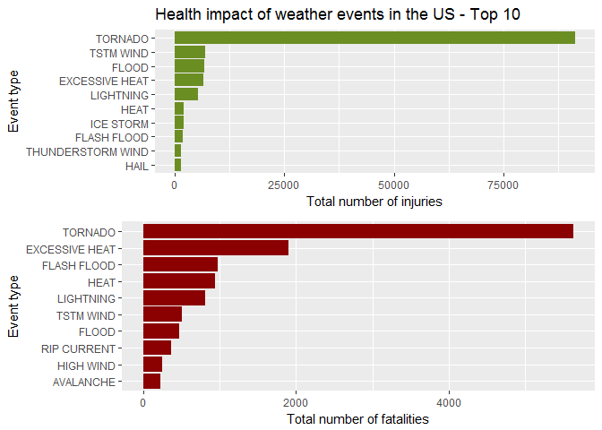
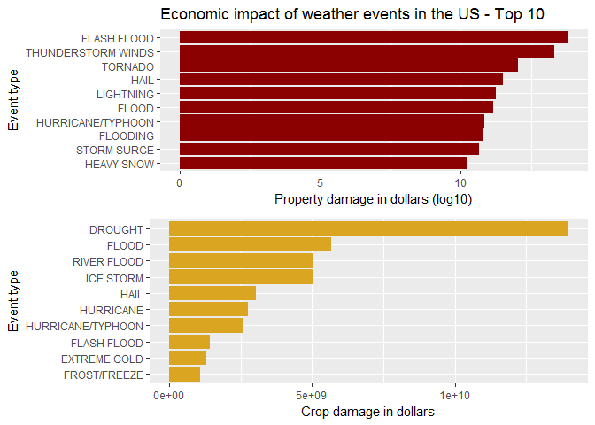

--
output: 
  html_document: 
    keep_md: yes
---

```r
my_render <- function(Project2.Rmd, encoding) {
    rmarkdown::render(Project2.Rmd, clean = FALSE, encoding = encoding)
}
```
---
title: "Reproducible Research : Project-2"
author: "Girish Desai"
date: "May 6, 2018"
output: html_fragment
---

#1.Synopsis

Storms and other severe weather events can cause both public health and economic problems for communities and municipalities. Many severe events can result in fatalities, injuries, and property damage, and preventing such outcomes to the extent possible is a key concern.

This project involves exploring the U.S. National Oceanic and Atmospheric Administration's (NOAA) storm database. This database tracks characteristics of major storms and weather events in the United States, including when and where they occur, as well as estimates of any fatalities, injuries, and property damage.

In this report,effect of weather events on personal as well as property damages was studied. Barplots were plotted seperately for the top 8 weather events that causes highest fatalities and highest injuries. Results indicate that most Fatalities and injuries were caused by Tornados.Also, barplots were plotted for the top 8 weather events that causes the highest property damage and crop damage.

#Questions Addressed

####1.Across the United States, which types of events are most harmful with respect to population health?

####2.Across the United States, which types of events have the greatest economic consequences?


#2.Data Processing

##Loading the data

The data was downloaded from the above mentioned website and saved on local computer. Then it was loaded on the R using the following code.


```r
library(plyr)
```

```
## Warning: package 'plyr' was built under R version 3.4.4
```

```r
library(ggplot2)
```

```
## Warning: package 'ggplot2' was built under R version 3.4.4
```

```r
library(gridExtra)
```

```
## Warning: package 'gridExtra' was built under R version 3.4.4
```

```r
library(grid)

setwd("C:/Users/t15cgvz/Desktop/R/ReproducibleResearch")
path <- getwd()
rm(list=ls())
storm<- read.csv("repdata%2Fdata%2FStormData.csv")
names(storm)
```

```
##  [1] "STATE__"    "BGN_DATE"   "BGN_TIME"   "TIME_ZONE"  "COUNTY"    
##  [6] "COUNTYNAME" "STATE"      "EVTYPE"     "BGN_RANGE"  "BGN_AZI"   
## [11] "BGN_LOCATI" "END_DATE"   "END_TIME"   "COUNTY_END" "COUNTYENDN"
## [16] "END_RANGE"  "END_AZI"    "END_LOCATI" "LENGTH"     "WIDTH"     
## [21] "F"          "MAG"        "FATALITIES" "INJURIES"   "PROPDMG"   
## [26] "PROPDMGEXP" "CROPDMG"    "CROPDMGEXP" "WFO"        "STATEOFFIC"
## [31] "ZONENAMES"  "LATITUDE"   "LONGITUDE"  "LATITUDE_E" "LONGITUDE_"
## [36] "REMARKS"    "REFNUM"
```

```r
dim(storm)
```

```
## [1] 902297     37
```
##Extracting the required data

This dataset consists of lot of information most of which is not required for our present study. So, here is the code to extract the required data for health and economic impact analysis against weather.


```r
stormDataRed <- storm[,c("EVTYPE", "FATALITIES", "INJURIES", "PROPDMG","PROPDMGEXP","CROPDMG","CROPDMGEXP")]
```

##Population Health

The fatalaties as well as the injuries are summarized according to the event type and then, respectively, ordered decreasingly.


```r
harm2health <- ddply(stormDataRed, .(EVTYPE), summarize,fatalities = sum(FATALITIES),injuries = sum(INJURIES))
fatal <- harm2health[order(harm2health$fatalities, decreasing = T), ]
injury <- harm2health[order(harm2health$injuries, decreasing = T), ]
```

##Economic Consequences

Since the exponential values are stored in a seperate column describing their value with letters (h = hundred, k = thousand, m = million, b = billion), the calucalion of the financial damage turns out to be slightly tricky. In a first step a function that converts the letter value of the exponent to a usable number must be implemented.


```r
getExp <- function(e) {
    if (e %in% c("h", "H"))
        return(2)
    else if (e %in% c("k", "K"))
        return(3)
    else if (e %in% c("m", "M"))
        return(6)
    else if (e %in% c("b", "B"))
        return(9)
    else if (!is.na(as.numeric(e))) 
        return(as.numeric(e))
    else if (e %in% c("", "-", "?", "+"))
        return(0)
    else {
        stop("Invalid value.")
    }
}
```

Then, using this function, the proper values are calculated for property damage and crop damage


```r
propExp <- sapply(stormDataRed$PROPDMGEXP, FUN=getExp)
stormDataRed$propDamage <- stormDataRed$PROPDMG * (10 ** propExp)
cropExp <- sapply(stormDataRed$CROPDMGEXP, FUN=getExp)
stormDataRed$cropDamage <- stormDataRed$CROPDMG * (10 ** cropExp)
```

Now the financial damage for crops and property have to be summarized according to the event type,
events not causing any financial damage will be omitted,
and finally, the data is sorted decreasingly:


```r
econDamage <- ddply(stormDataRed, .(EVTYPE), summarize,propDamage = sum(propDamage), cropDamage = sum(cropDamage))
econDamage <- econDamage[(econDamage$propDamage > 0 | econDamage$cropDamage > 0), ]
propDmgSorted <- econDamage[order(econDamage$propDamage, decreasing = T), ]
cropDmgSorted <- econDamage[order(econDamage$cropDamage, decreasing = T), ]
```

#3.Results 

Lists of the Top 5 weather events affecting the populations health (injuries and deaths) are shown. For injuries as well as fatal events the most devastating events are tornados in the given time period.


```r
head(injury[, c("EVTYPE", "injuries")],5)
```

```
##             EVTYPE injuries
## 834        TORNADO    91346
## 856      TSTM WIND     6957
## 170          FLOOD     6789
## 130 EXCESSIVE HEAT     6525
## 464      LIGHTNING     5230
```


```r
head(fatal[, c("EVTYPE", "fatalities")],5)
```

```
##             EVTYPE fatalities
## 834        TORNADO       5633
## 130 EXCESSIVE HEAT       1903
## 153    FLASH FLOOD        978
## 275           HEAT        937
## 464      LIGHTNING        816
```


The plots of the Top 10 events paint an even clearer picture:


```r
p1 <- ggplot(data=head(injury,10), aes(x=reorder(EVTYPE, injuries), y=injuries)) +
   geom_bar(fill="olivedrab",stat="identity")  + coord_flip() + 
    ylab("Total number of injuries") + xlab("Event type") +
    ggtitle("Health impact of weather events in the US - Top 10") +
    theme(legend.position="none")

p2 <- ggplot(data=head(fatal,10), aes(x=reorder(EVTYPE, fatalities), y=fatalities)) +
    geom_bar(fill="red4",stat="identity") + coord_flip() +
    ylab("Total number of fatalities") + xlab("Event type") +
    theme(legend.position="none")

grid.arrange(p1, p2, nrow =2)
```

<!-- -->

Again the plots show, that tornados are by far the most dangerous events when it comes to population health. Heat and floods also seem to cause a high number of deaths and injuries

##Economic Consequences

Lists of the Top 5 weather events causing financial damage to both property and crops are shown below. For property flash floods, thunderstorms and tornados seem to cause by far the most damage (orders of magnitude above the other event types!).

Probably little suprising the weather event causing most financial damage in respect to agriculture (i.e. crops) is drought. Noteworthy damage is also done by flood events as well as hail and ice storms.


```r
head(propDmgSorted[, c("EVTYPE", "propDamage")], 5)
```

```
##                 EVTYPE   propDamage
## 153        FLASH FLOOD 6.820237e+13
## 786 THUNDERSTORM WINDS 2.086532e+13
## 834            TORNADO 1.078951e+12
## 244               HAIL 3.157558e+11
## 464          LIGHTNING 1.729433e+11
```


```r
head(cropDmgSorted[, c("EVTYPE", "cropDamage")], 5)
```

```
##          EVTYPE  cropDamage
## 95      DROUGHT 13972566000
## 170       FLOOD  5661968450
## 590 RIVER FLOOD  5029459000
## 427   ICE STORM  5022113500
## 244        HAIL  3025974480
```

The findings described above become even more evident when we plot the Top 10 events for both property and crop damage! (Note that for plotting the property damage a logarithmic scale was used in order to increase the readability of the plot)


```r
p1 <- ggplot(data=head(propDmgSorted,10), aes(x=reorder(EVTYPE, propDamage), y=log10(propDamage), fill=propDamage )) +
    geom_bar(fill="darkred", stat="identity") + coord_flip() +
    xlab("Event type") + ylab("Property damage in dollars (log10)") +
    ggtitle("Economic impact of weather events in the US - Top 10") +
    theme(plot.title = element_text(hjust = 0))

p2 <- ggplot(data=head(cropDmgSorted,10), aes(x=reorder(EVTYPE, cropDamage), y=cropDamage, fill=cropDamage)) +
    geom_bar(fill="goldenrod", stat="identity") + coord_flip() + 
    xlab("Event type") + ylab("Crop damage in dollars") + 
    theme(legend.position="none")

grid.arrange(p1, p2, ncol=1, nrow =2)
```

<!-- -->

The plot showed that flood, hirricane/typhoon and tornado hit the properties the hardest while drought and different types of flood hit the crop the hardest.

